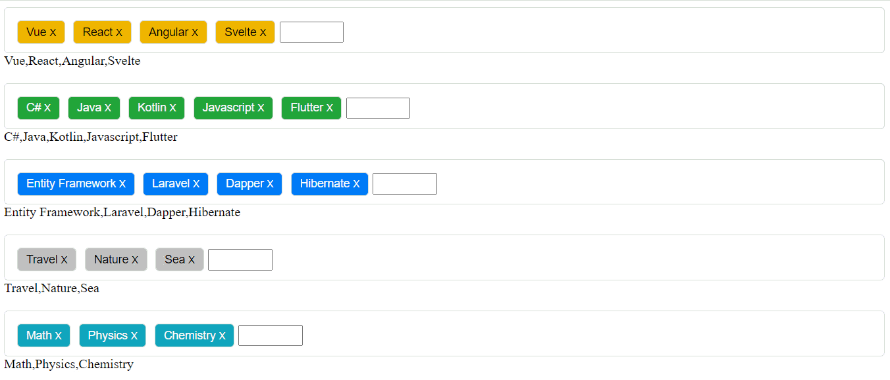

# Welcome to Vuejs Tag Component 👋

> Vuejs tag component. Simple, easy.




### Installing

You can install this component by npm

```
npm i vuejs-light-tag-component
```

After download, vuejs-light-tag-component will be ready to use in your VueJS Applications

Usage

- Just import Components from node_modules folder in main.js

```
import Tags from "vuejs-light-tag-component"
```

- Register vuejs-light-tag-component component with any name you want

```
Vue.component("app-tags", Tags);
```

After this step, vuejs-light-tag-component can be used by all registered component in your project with app-tags tag name

- You can use with

```
<app-tags></app-tags>
```

#### Styling

this component has 8 color options

- default
- primary
- secondary
- success
- danger
- light
- info
- warning

To use these colors, just add 'color' attribute into app-tags component

```
<app-tags color="default"></app-tags>
```

```
<app-tags color="primary"></app-tags>
```

```
<app-tags color="secondary"></app-tags>
```

```
<app-tags color="success"></app-tags>
```

```
<app-tags color="danger"></app-tags>
```

```
<app-tags color="info"></app-tags>
```

```
<app-tags color="warning"></app-tags>
```

```
<app-tags color="default"></app-tags>
```


#### Data Binding

Also you can bind app-tags component by v-model VueJS directive

```
<app-tags v-model="tags"></app-tags>
```
